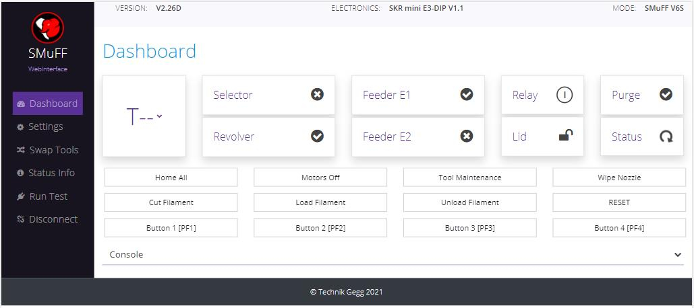

# SMuFF-WebInterface

This is a browser app using HTML/Bootstrap 5 and it utilizes the [Web Serial API](https://web.dev/serial/). This means, no matter from what location you've opened this app, it will run locally in your browser and connect to the [SMuFF](https://sites.google.com/view/the-smuff/?authuser=43) via a serial interface. Thus, your SMuFF has to be connected to your PC either via a local (USB) serial port or via a virtual Bluetooth serial port.

Even though the SMuFF controller has its own interface (a 128x64 display and encoder), setting up all the operating parameters on the SMuFF to match your environment might be tedious and can hardly be controlled from afar, which was my main motivation for creating this app.

The app does not only show and control the main information on the Dashboard (*Tool*, *Relay*, *Lid*, *Purge* and *Status* can change their state by clicking), it also features a console window, where you can send GCode commands and see the response coming from the SMuFF, just like in an regular terminal app.
Unlike a regular terminal app, it will add new commands to the history, which can be saved locally for later sessions. Commands sent via the GCode input field will also appear in the console window for a better overview which response was caused by which command.

Changes in the settings are being sent to the SMuFF immediately, which makes testing out new parameters quickly a breeze. Though, such changes will stay in memory of the SMuFF unless you either reset or power-cycle it. To make the changed permanent, click the "Save to SD-Card" button.

Running test scripts is also much more convenient. All results created by the testscript will show within the "Run Test" panel.

So far, I can confirm it runs flawlessly in either **Google Chrome** or **Microsoft Edge** browser.

**Opera** browser does show the devices available but doesn't show me the "Connect" button.

**Firefox** seems **not** to support the [Web Serial API](https://web.dev/serial/).

---

Click [here to open this app](https://technik-gegg.github.io/SMuFF-WI/). Keep in mind, this app needs firmware version [2.26 or later](https://github.com/technik-gegg/SMuFF-1.1/tree/SMuFF-2.0-(Experimental)) on the SMuFF to run.

---

I've also added my source file to this repository, which has to be opened in [Bootstrap Studio](https://bootstrapstudio.io/). This tool is not a free tool but makes editing HTML files in conjunction with Bootstrap much less a pain.
